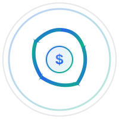

# SpendFlow - Multi-User Finance Management App

A modern, sleek finance management web application built with Next.js, Tailwind CSS, and Firebase. SpendFlow helps users manage their monthly expenses, income, debit/credit cards, and transactions in one place.



## 🎯 Features

### Core Features
- **Multi-user Authentication** - Google Sign-In + Email/Password
- **Dashboard Overview** - Income, expenses, and balance charts
- **Recurring Expenses** - Add, edit, delete monthly recurring expenses
- **Income Management** - Track income sources (Salary, Freelance, Investment, etc.)
- **Card Management** - Manage debit and credit cards with 3D visual style
- **Transactions** - Add transactions and choose which card is used
- **Refunds** - Add refunds to any card
- **Currency Selection** - Per-user currency preference with instant conversion
- **Admin Panel** - Manage users, view platform totals, delete/suspend users
- **Responsive Layout** - Sidebar navigation with all core pages

### UI/UX
- Sleek, professional design (Stripe + Revolut + Notion style)
- Rounded corners and glassmorphism accents
- Smooth animations with Framer Motion
- Color scheme: Deep Blue (#2563EB) and Emerald Green (#10B981)
- Charts with smooth animations using Recharts

## 🛠️ Tech Stack

- **Frontend**: Next.js 16 with TypeScript
- **Styling**: Tailwind CSS 4
- **Authentication**: Firebase Auth
- **Database**: Firebase Firestore
- **Hosting**: Firebase Hosting
- **Charts**: Recharts
- **Animations**: Framer Motion
- **Icons**: Lucide React

## 📦 Installation

### Prerequisites
- Node.js 18+ and npm
- Firebase CLI
- A Firebase project

### Setup Steps

1. **Clone and install dependencies**
```bash
cd spendflow-app
npm install
```

2. **Configure Firebase**
   - Copy `env.template` to `.env.local` and fill in your Firebase credentials
   - Or update `src/firebase/config.ts` directly with your Firebase credentials
   - Get credentials from Firebase Console > Project Settings > Your apps
   ```bash
   cp env.template .env.local
   # Then edit .env.local with your actual Firebase values
   ```

3. **Set up Firebase Authentication**
   - Enable Email/Password authentication
   - Enable Google Sign-In
   - Add authorized redirect URIs

# Run development server
npm run dev
```

Open [http://localhost:3000](http://localhost:3000) to see the app.

---

## 📁 Project Structure

npm run build
```

2. **Deploy to Firebase**
```bash
npm run firebase:deploy
```

Or deploy specific components:
```bash
npm run firebase:deploy:hosting    # Deploy hosting only
npm run firebase:deploy:firestore  # Deploy Firestore rules and indexes
npm run firebase:deploy:rules      # Deploy Firestore rules only
```

3. **Access your app**
Your app will be available at: `https://your-project-id.web.app`

## 📊 Data Models

### UserProfile
```typescript
{
  uid: string;
  email: string;
  displayName: string;
  photoURL?: string;
  currency: string;
  isAdmin?: boolean;
  createdAt: Date;
  updatedAt: Date;
}
```

### Card
```typescript
{
  id: string;
  userId: string;
  cardNumber: string;
  cardHolder: string;
  expiryDate: string;
  cvv: string;
  type: 'credit' | 'debit';
  balance: number;
  limit?: number;
  color: string;
  isActive: boolean;
  createdAt: Date;
  updatedAt: Date;
}
```

### Transaction
```typescript
{
  id: string;
  userId: string;
  cardId: string;
  amount: number;
  type: 'expense' | 'income' | 'refund' | 'transfer';
  category: string;
  description: string;
  date: Date;
  isRecurring: boolean;
  recurringFrequency?: 'daily' | 'weekly' | 'monthly' | 'yearly';
  createdAt: Date;
  updatedAt: Date;
}
```

## 🎨 Color Scheme

- **Primary Blue**: #2563EB
- **Primary Green**: #10B981
- **Success**: #10B981
- **Error**: #EF4444
- **Warning**: #F59E0B

## 📝 Environment Variables

Create a `.env.local` file in the root directory:

```env
NEXT_PUBLIC_FIREBASE_API_KEY=your_key
NEXT_PUBLIC_FIREBASE_AUTH_DOMAIN=your_domain
NEXT_PUBLIC_FIREBASE_PROJECT_ID=your_project_id
NEXT_PUBLIC_FIREBASE_STORAGE_BUCKET=your_bucket
NEXT_PUBLIC_FIREBASE_MESSAGING_SENDER_ID=your_sender_id
NEXT_PUBLIC_FIREBASE_APP_ID=your_app_id
NEXT_PUBLIC_FIREBASE_MEASUREMENT_ID=your_measurement_id
```

## 🧪 Testing

The app includes:
- TypeScript for type safety
- ESLint for code quality
- Responsive design testing across devices

## 📚 Project Structure

```
src/
├── app/                    # Next.js app router pages
│   ├── (auth)/            # Authentication pages
│   ├── (dashboard)/       # Protected dashboard pages
│   └── layout.tsx         # Root layout
├── components/            # Reusable React components
│   ├── cards/            # Card management components
│   ├── dashboard/        # Dashboard components
│   ├── expenses/         # Expense components
│   ├── income/           # Income components
│   ├── layout/           # Layout components
│   ├── transactions/     # Transaction components
│   ├── auth/             # Auth components
│   └── ui/               # UI components
├── contexts/             # React contexts
├── firebase/             # Firebase configuration
├── lib/                  # Utility functions and services
│   ├── firebase/         # Firestore services
│   └── services/         # Business logic services
└── types/                # TypeScript type definitions
```

## 🤝 Contributing

Contributions are welcome! Please feel free to submit a Pull Request.

## 📄 License

This project is open source and available under the MIT License.

## 🆘 Support

For issues and questions:
1. Check the documentation
2. Review Firebase documentation
3. Open an issue on the repository

## 🎯 Future Enhancements

- [ ] Budget planning and alerts
- [ ] Investment tracking
- [ ] Bill reminders
- [ ] Multi-currency conversion
- [ ] Export to CSV/PDF
- [ ] Mobile app
- [ ] Advanced analytics
- [ ] Subscription management
- [ ] Recurring transaction automation
- [ ] Receipt scanning with OCR
